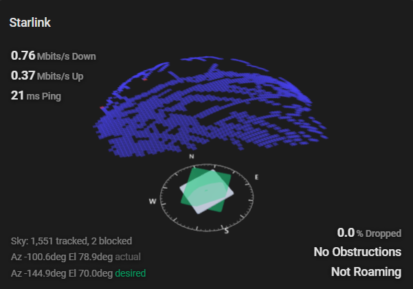
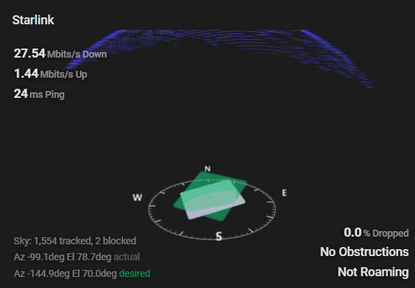

# Starlink Custom Home Assistant Integration

This is a custom-component copy of Home Assistant's official `starlink`
integration, using the same `starlink` domain so it can override the built-in
integration when installed under `custom_components/starlink`.

Extra additions:

- Desired azimuth sensor
- Desired elevation sensor
- Native Lovelace obstruction/alignment card
- Home Assistant websocket endpoint for obstruction map data, avoiding add-on
  ingress sessions

## Install With HACS And GitHub

1. Push this repository to a public GitHub repo.
2. In Home Assistant, open HACS.
3. Go to HACS > Integrations.
4. Open the three-dot menu and choose Custom repositories.
5. Add your GitHub repository URL.
6. Select category Integration.
7. Install `Starlink Custom`.
8. Restart Home Assistant.

The repository is laid out for HACS as:

```text
custom_components/starlink/
hacs.json
README.md
```

HACS requires a public GitHub repository with a README and `hacs.json` at the
repository root.

## Manual Install

Copy `custom_components/starlink` into your Home Assistant config directory:

```text
/config/custom_components/starlink
```

Restart Home Assistant. The integration still appears as Starlink, but the
manifest name is `Starlink Custom` so you can confirm the custom copy loaded.

## Lovelace Card





After the integration is loaded, add this Lovelace resource:

```text
/starlink-static/starlink-obstruction-card.js
```

Then use:

```yaml
type: custom:starlink-obstruction-card
title: Starlink
aspect_ratio: 16:9
```

Optional fields:

```yaml
entry_id: your_starlink_config_entry_id
height: 420px
refresh_interval: 5000
obstruction_threshold: 0.65
clear_color: "#42e0f5"
obstructed_color: "#f7524a"
desired_color: "#00d47e"
```

`entry_id` is only needed if you have more than one Starlink config entry.


